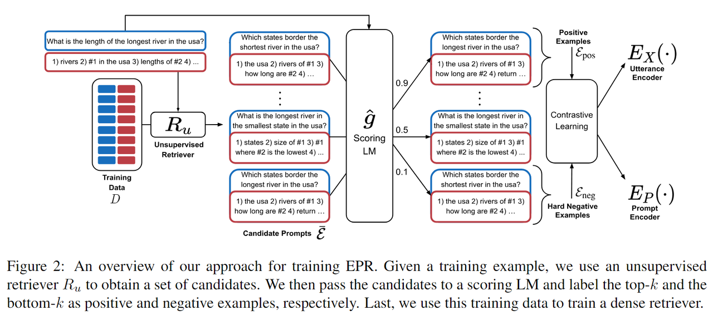
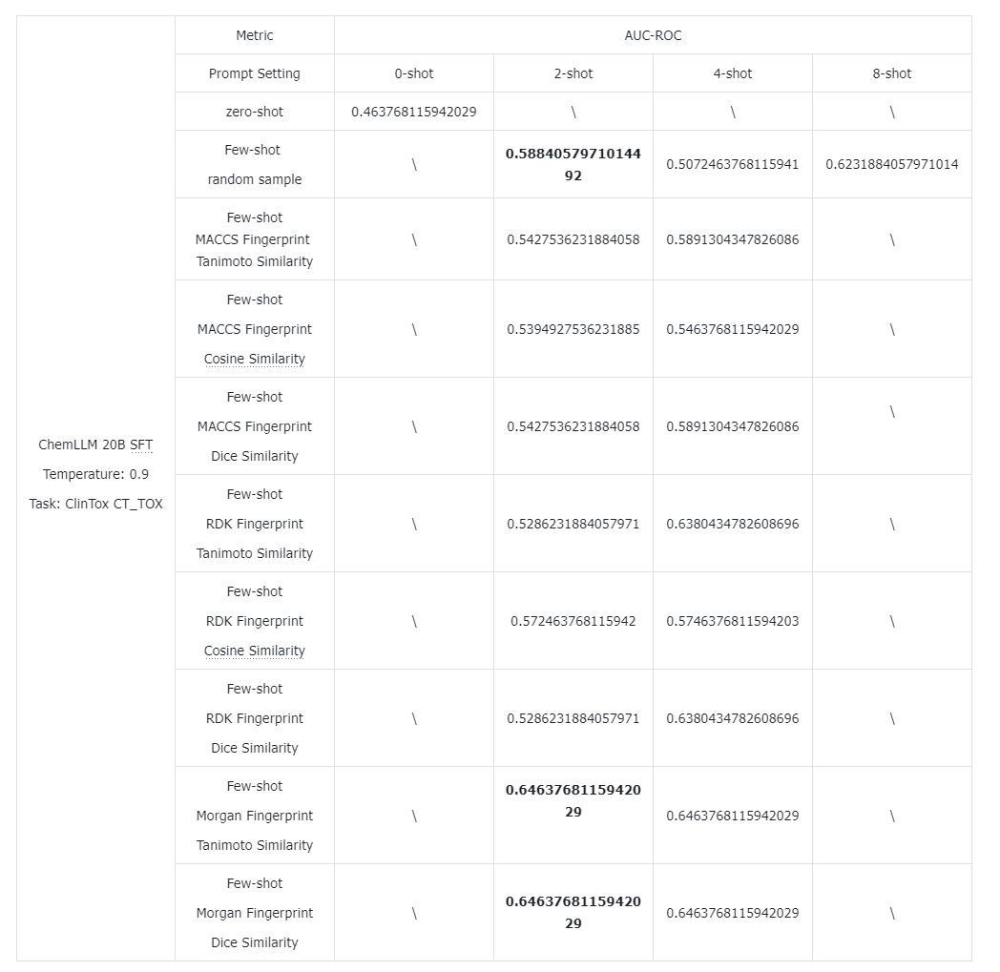
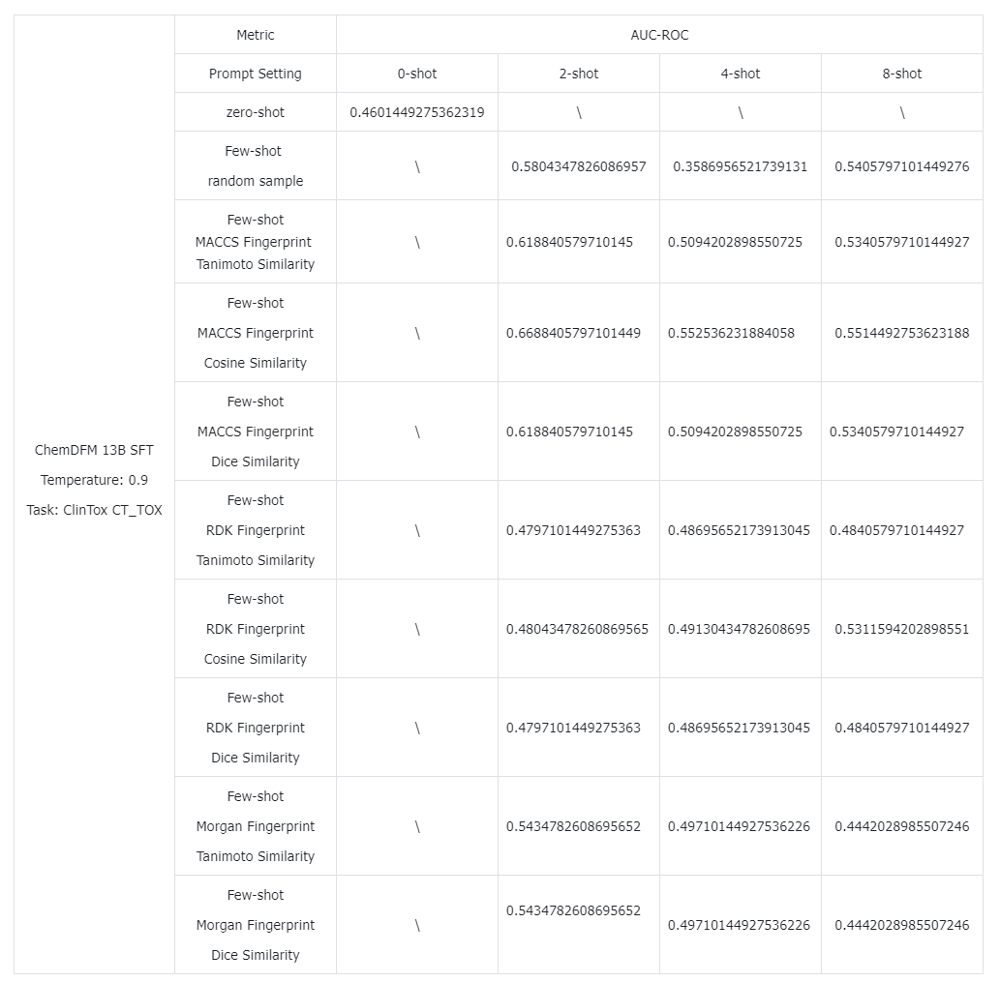

# In-Context Learning Enhanced Molecule Property Prediction via LLMs

## 1-Unsupervised Sample Selection
Experimented with LLMs using *zero-shot* and *few-shot* In-Context Learning in an **unsupervised manner** to select samples across various settings, including random selection and fingerprint-based methods (MACCS,
RDKit, Morgan) with Tanimoto and Cosine similarities.

## 2-Supervised Sample Selection
Adapted the Efficient Prompt Retrieval algorithm (this [NAACL 2022 paper](https://arxiv.org/abs/2112.08633)) for **supervised sample selection**.  

Trained a retriever with *contrastive learning* to select more accurate ICL samples during testing, yielding modest improvements.

### Step

#### Step 1
- For every $x\in D_{train}$，select k-NN $x$ to obtain $D_{knn}$ from $D_{train}$.
- For every $x'\in D_{knn}$，then, using this as an example of 1-shot ICL for $x$, calculate the confidence of model's prediction of the label, which is the score of $x'$.
- Store all samples in a json file, with formats like: $\{x,x',score\}$.

#### Step 2
- Use contrastive learning to train a retriever model, as the metric model to select samples during testing.
- The object function is adapted from this [NAACL 2022 paper](https://arxiv.org/abs/2112.08633).
- Use `bert-base-smiles` model as the encoder model to get the embeddings of $x$ and samples.

## 3-Results

